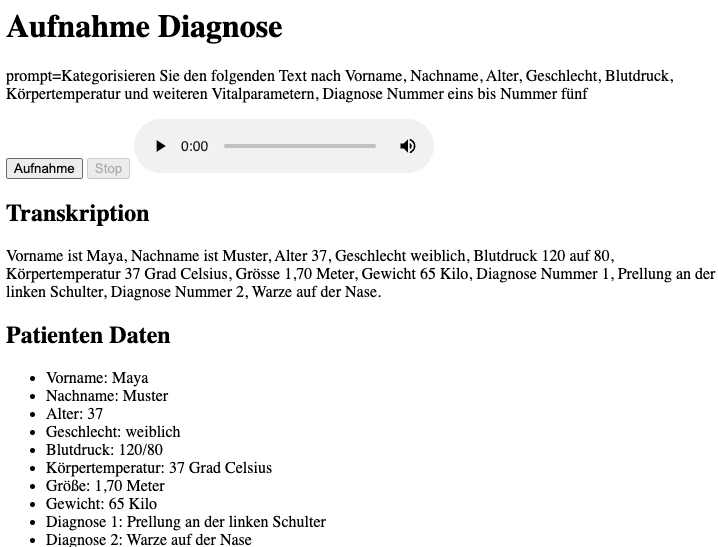

# Speech2Structure

## Voraussetzungen

- Node.js 14 oder höher
- OpenAI API-Schlüssel

## Installation

1. Klone das Repository:
    ```sh
    git clone https://github.com/yourusername/nodejs-speech2structure.git
    cd nodejs-speech2structure
    ```

2. Installiere die benötigten Pakete:
    ```sh
    npm install
    ```

3. Erstelle eine `.env` Datei im Projektverzeichnis und füge deinen OpenAI API-Schlüssel hinzu:
    ```env
    OPENAI_API_KEY=dein_openai_api_schlüssel
    ```

## Build

Für dieses Projekt sind keine Build-Schritte erforderlich.

## Ausführen / Im Webbrowser aufrufen

1. Starte den Node.js-Server:
    ```sh
    npm start
    ```

2. Öffne deinen Webbrowser und navigiere zu:
    ```
    http://127.0.0.1:3000/
    ```

3. Verwende die Weboberfläche, um Audio aufzunehmen und zu verarbeiten.

# Demo

